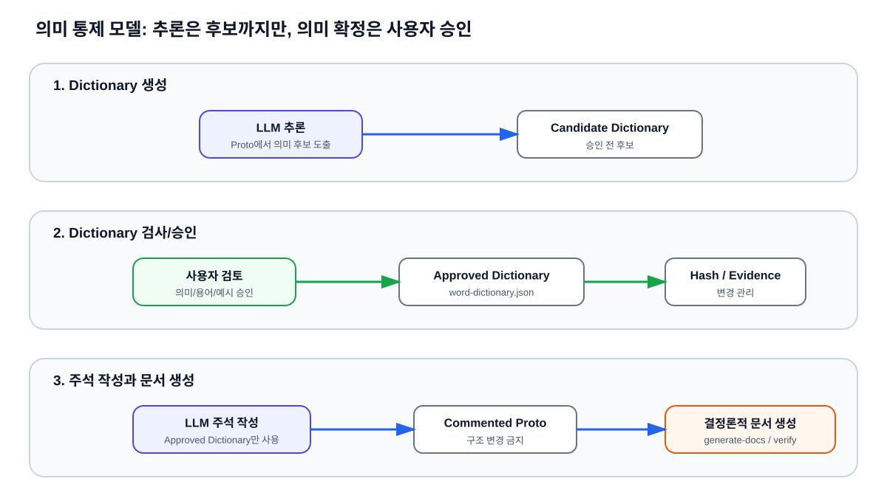
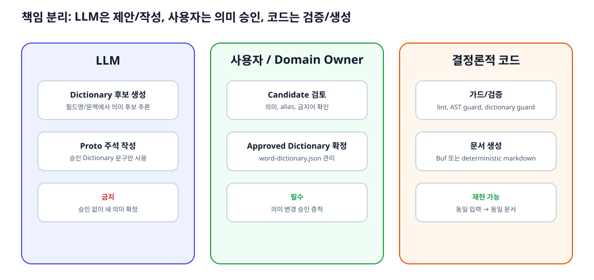
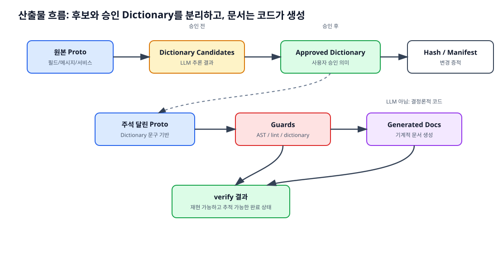
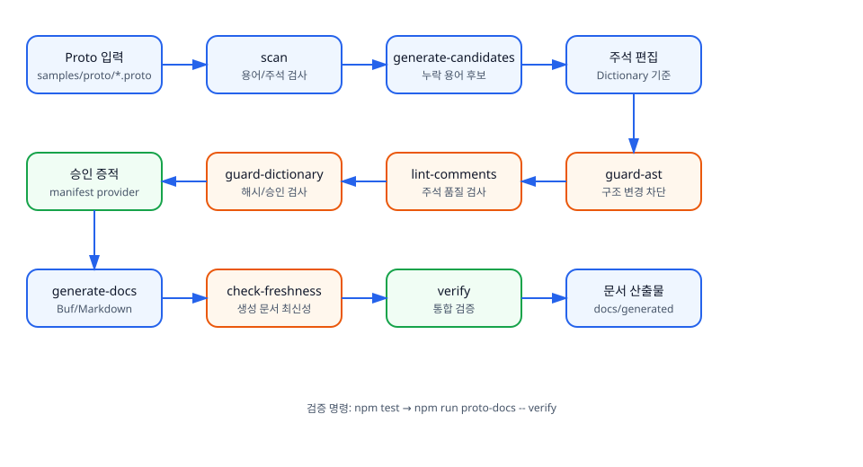

# Proto Docs Claude Code Plugin

Proto Docs는 Claude Code에서 Proto 주석 작성, Dictionary 후보 생성, 승인된 Dictionary 기반 검증, 문서 생성을 지원하는 로컬 플러그인입니다.

이 플러그인은 LLM이 Proto 의미를 임의로 확정하지 못하도록 하고, 승인된 Dictionary와 기계적 검증으로 Proto 문서화 흐름을 통제합니다.

## 주요 기능

- Claude Code 플러그인으로 commands, skills, hooks 제공
- Proto 필드 주석을 승인된 Dictionary 기준으로 작성/검증
- 누락된 Dictionary 항목 후보 생성
- 승인된 후보만 Dictionary로 승격
- Proto AST 변경 가드로 주석 외 구조 변경 차단
- Dictionary 해시 및 승인 증적 검증
- Proto 문서 생성 및 최신성 검사

## 설치

대상 프로젝트에 `claude-code-plugin/` 폴더를 복사한 뒤, 프로젝트 루트에서 Claude Code를 다음과 같이 실행합니다.

```bash
claude --plugin-dir ./claude-code-plugin/proto-docs
```

플러그인 루트인 `claude-code-plugin/proto-docs/`에는 자체 `package.json`이 포함되어 있어, 복사 설치 후에도 hook과 CLI 스크립트가 ESM으로 실행됩니다.

플러그인 manifest는 다음 위치에 있습니다.

```text
claude-code-plugin/proto-docs/.claude-plugin/plugin.json
```

manifest는 다음 컴포넌트를 로드합니다.

- `commands/`: Claude Code slash-command 안내
- `skills/`: Proto Docs 작업 지침
- `hooks/hooks.json`: 파일 변경 후 자동 검증 hook

## 플러그인 구성

```text
claude-code-plugin/proto-docs/
├── .claude-plugin/plugin.json
├── commands/
├── skills/
├── hooks/
├── scripts/proto-docs/
└── dictionary/
```

## 대상 프로젝트 요구 사항

플러그인을 사용하는 대상 프로젝트는 승인된 Dictionary와 후보 디렉터리를 포함해야 합니다.

```text
.proto-docs/dictionary/word-dictionary.json
.proto-docs/dictionary/word-dictionary.sha256
.proto-docs/dictionary/candidates/
```

플러그인은 scripts와 schema를 제공하지만, 승인된 Dictionary 데이터는 대상 프로젝트가 소유합니다.

## Claude Code에서 사용하는 흐름

1. Proto 파일을 스캔합니다.
2. Dictionary에 없는 필드는 후보로 생성합니다.
3. 후보 의미는 사용자 또는 도메인 담당자가 승인합니다.
4. 승인된 후보만 Dictionary로 승격합니다.
5. Proto 주석은 승인된 Dictionary 설명만 사용해 작성합니다.
6. hook과 CLI가 Proto 구조 변경, Dictionary 변경, 주석 불일치를 검증합니다.
7. 문서를 생성하고 최신성을 확인합니다.

## 제공 commands

플러그인은 다음 command 안내 파일을 제공합니다.

```text
claude-code-plugin/proto-docs/commands/generate-candidates.md
claude-code-plugin/proto-docs/commands/promote-candidates.md
claude-code-plugin/proto-docs/commands/apply-comments.md
```

## 제공 skills

```text
claude-code-plugin/proto-docs/skills/proto-docs-flow/
claude-code-plugin/proto-docs/skills/proto-docs-dictionary/
```

## 자동 hooks

`PostToolUse` hook은 `Write`, `Edit`, `MultiEdit` 이후 다음 검증 스크립트를 실행하도록 구성되어 있습니다.

```text
proto-docs-post-tool-use.js
proto-docs-dictionary-post-tool-use.js
proto-docs-schema-post-tool-use.js
proto-docs-candidates-post-tool-use.js
```

## 로컬 CLI

플러그인 내부 CLI는 commands와 hooks에서 사용됩니다. 직접 실행할 수도 있습니다.

```bash
npm install
npm run proto-docs -- verify
npm run proto-docs -- scan --proto samples/proto/asset.proto
npm run proto-docs -- generate-candidates --proto samples/proto/unmapped.proto
npm run proto-docs -- lint-comments
npm run proto-docs -- guard-ast --before samples/proto/asset.proto --after samples/proto/asset.proto
npm run proto-docs -- guard-dictionary
npm run proto-docs -- generate-docs --generator buf
npm run proto-docs -- check-freshness
```

샘플 검증:

```bash
npm test
npm run proto-docs -- verify
```

`buf` 없이 결정적 샘플 문서를 생성하려면 다음을 사용합니다.

```bash
npm run proto-docs -- generate-docs -- --generator markdown-sample
```

## 개발 모델

Proto Docs는 LLM을 “의미 후보 생성과 주석 작성”에만 사용하고, 의미 확정은 사용자 승인으로, 최종 문서 생성은 결정론적 코드로 분리합니다. Claude Code hook/script는 위반이 감지되면 LLM에게 `[PROTO DOCS REMINDER]`를 출력하고 진행을 차단하도록 구성됩니다.







## 전체 Workflow

아래 흐름은 Dictionary 기반 Proto 주석 작성부터 검증, 문서 생성, 최신성 확인까지의 전체 로컬 workflow입니다.



## 문서

- 플러그인 README: [`claude-code-plugin/proto-docs/README.md`](claude-code-plugin/proto-docs/README.md)
- CLI 사용법: [`docs/proto-docs/usage.md`](docs/proto-docs/usage.md)
- 에이전트 플로우: [`docs/proto-docs/agent-flow.md`](docs/proto-docs/agent-flow.md)
- 승인 정책: [`docs/proto-docs/approval-policy.md`](docs/proto-docs/approval-policy.md)
- 생성 문서 예시: [`docs/generated/proto-docs.md`](docs/generated/proto-docs.md)

## 네트워크 정책

이 CLI와 플러그인 hook은 LLM API 또는 네트워크 서비스를 호출하지 않습니다. 승인 검증은 로컬 manifest provider만 사용합니다.
